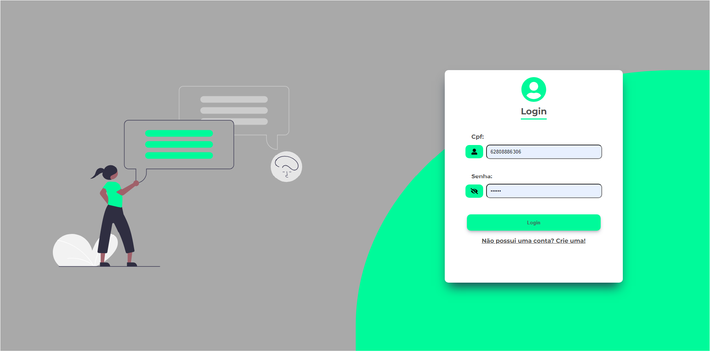
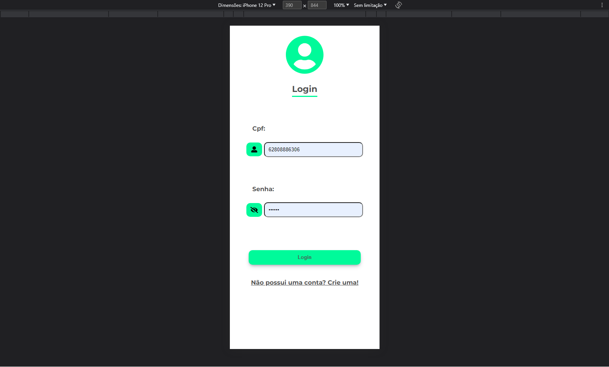
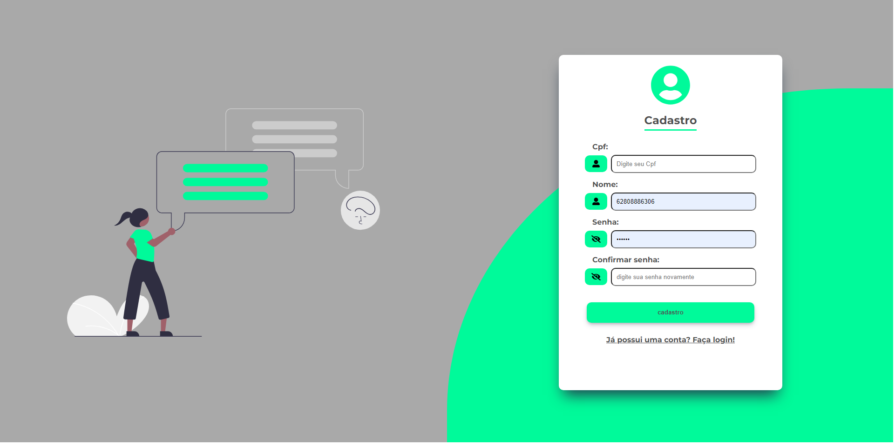
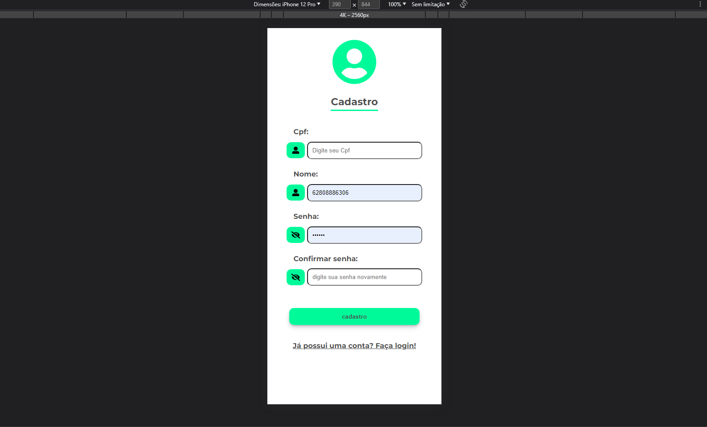
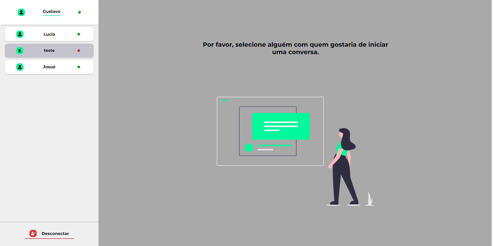
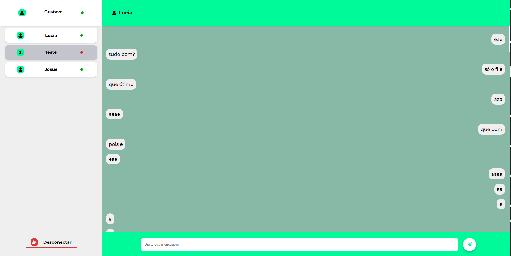
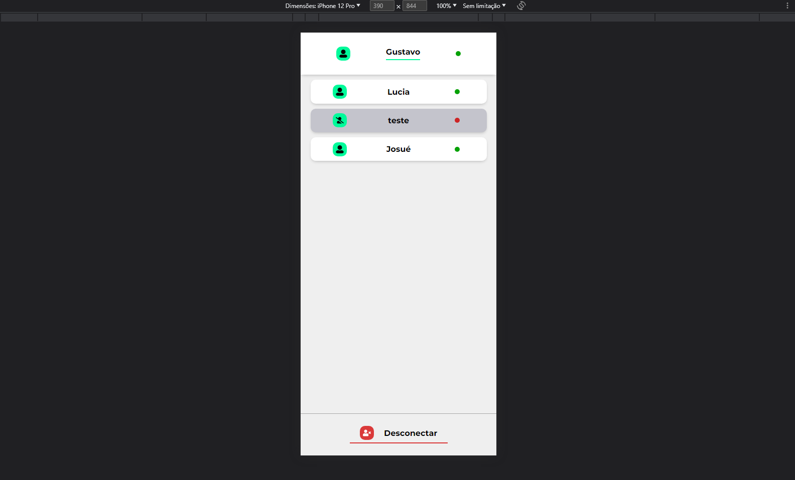
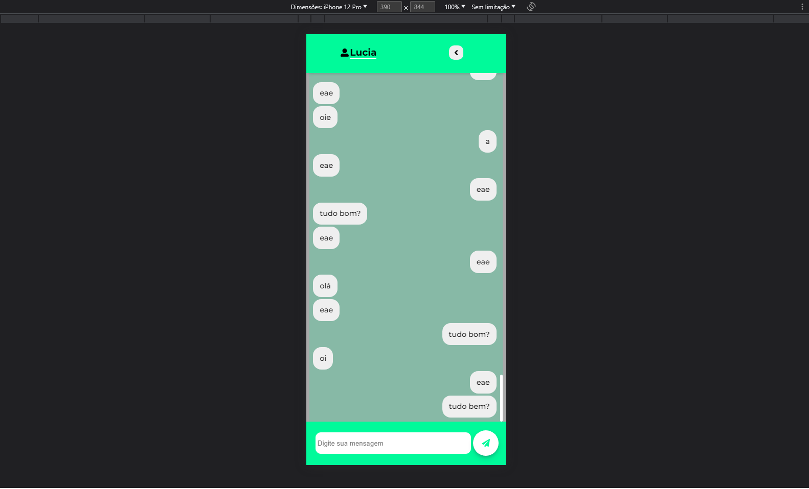

# Desafio técnico - VAGA JAVASCRIPT INICIANTE

## Sobre o desafio

O desafio consistiu no desenvolvimento de um chat em tempo real, que envolvia a implementação de um CRUD (Create, Read, Update, Delete), autenticação de usuários e uma interface amigável.

### Funcionalidades implementadas:

- **Chat em tempo real:** Desenvolvido um chat em tempo real que permite a troca instantânea de mensagens entre os usuários.
- **CRUD:** Implementado um CRUD (Create, Read, Update, Delete) para gerenciar as mensagens do chat. Os usuários podem criar, ler, atualizar e excluir suas mensagens.
- **Autenticação:** Adicionada uma camada de autenticação para garantir que apenas usuários autenticados possam acessar o chat e realizar operações.
- **Interface:** Criada uma interface amigável que permite aos usuários interagirem facilmente com o chat. Isso inclui a exibição das mensagens, área de digitação, notificações em tempo real e outros elementos.

### Tecnologias utilizadas:

- **Frontend:** Utilizou-se ReactJS para desenvolver a interface do chat. O ReactJS é uma biblioteca JavaScript popular para a construção de interfaces de usuário interativas.
- **Backend:** O servidor do chat foi implementado com Node.js, uma plataforma JavaScript para o desenvolvimento de aplicações de rede.
- **Banco de dados:** Foi utilizado o MongoDB, um banco de dados NoSQL, para armazenar as mensagens do chat.
- **Autenticação:** A autenticação dos usuários foi realizada utilizando tokens JWT (JSON Web Tokens) para garantir a segurança das operações.
- **Comunicação em tempo real:** A comunicação em tempo real entre o servidor e os clientes foi estabelecida utilizando a biblioteca Socket.io, permitindo a troca de mensagens bidirecionais.

O desafio proporcionou a oportunidade de aplicar conhecimentos em desenvolvimento web, utilizando tecnologias modernas e práticas de programação adequadas.

## Como iniciar o projeto?

Siga as instruções abaixo para iniciar o projeto:

### Iniciar Front-end e Back-end juntos

Para iniciar tanto o front-end quanto o back-end simultaneamente, execute o seguinte comando na raiz do projeto:

```bash
npm run dev
```

Para iniciar somente o front-end, execute o seguinte comando :

```bash
cd client
npm start
```

Para iniciar somente o back-end, execute o seguinte comando na raiz do projeto:

```bash
nodemon index
```

## Fotos do projeto

### Tela login - Pc/Mobile




### Tela Cadastro - Pc/Mobile




### Tela Chat - Pc/Mobile







